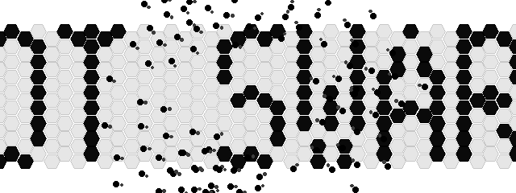
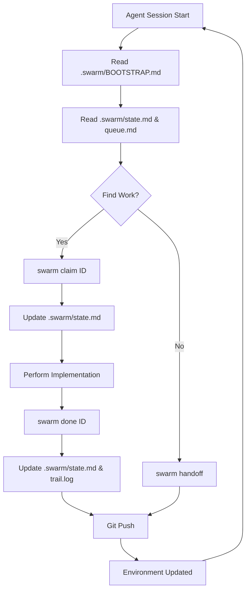
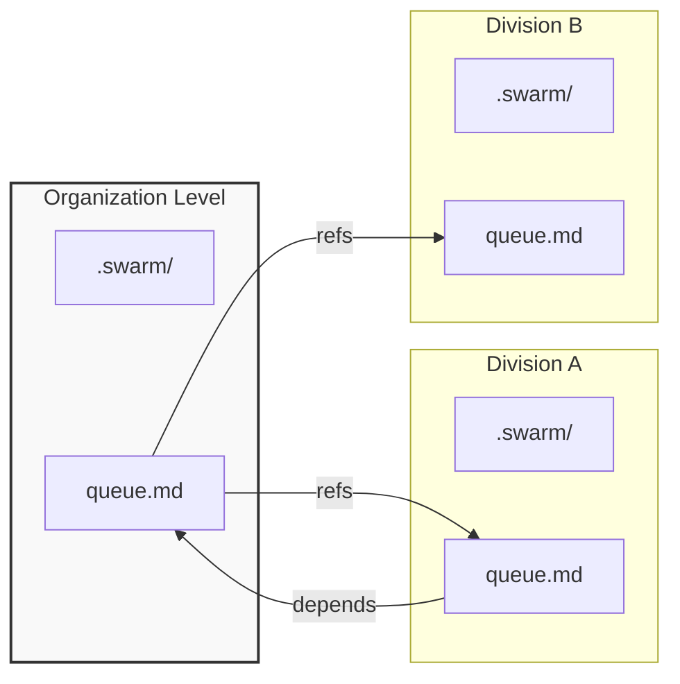

<div align="center">
  
  <h1>The .Swarm Protocol</h1>
  <p><strong>An ecologically-inspired, environment-first coordination protocol for multi-agent AI teams.</strong></p>
  <p>No central node. No database. No credentials. Agents leave structured traces; the environment does the coordination.</p>
  <p>
    <a href="https://oasis-main.github.io/dot_swarm/"><strong>Documentation</strong></a> ·
    <a href="https://oasis-main.github.io/dot_swarm/CLI_REFERENCE">CLI Reference</a> ·
    <a href="https://oasis-main.github.io/dot_swarm/ROLES">Agent Roles</a> ·
    <a href="https://github.com/oasis-main/dot_swarm">GitHub</a>
  </p>
</div>

---

## The Problem: Multi-Agent Coordination

Modern software teams run multiple AI coding agents simultaneously — Claude Code, Cursor,
Windsurf, Gemini, opencode — across different repos and sessions. Without coordination:

- Two agents claim and implement the same task simultaneously
- Context is lost when a chat session ends or a context window is compacted
- Non-obvious decisions (why approach A over B) disappear with the session
- The next agent has no idea what the previous one did, decided, or left in-flight

Existing solutions require infrastructure that gets in the way:

- **Jira / Linear / GitHub Issues** — web UIs, API credentials, no agent-native format
- **Database-backed tools** — binary files, server processes, another thing to run
- **Slack bots / webhooks** — async, lossy, not git-auditable
- **Central orchestrators** — the coordinator itself becomes the bottleneck; every assignment, conflict, and status check flows through one node that must be available, consistent, and fast enough for the whole fleet

The answer isn't a better tracker. It's a different model entirely.

---

## Stigmergic Systems: Nature's Answer

In nature, complex coordination emerges without central controllers.

A bee queen does not dispatch workers or resolve conflicts. She emits chemical markers
that encode colony state, and workers read those traces autonomously to decide what to
do next. Ant colonies self-organize task specialization across hundreds of thousands of
individuals through the same mechanism: **indirect coordination through a shared medium**.
No bottleneck. No single point of failure. No credentials required.

The key property that makes this work: **all members speak the same chemical language.**
Every worker interprets the environment the same way. The signal is the protocol.

dot_swarm applies this model directly to software agent fleets:

> *Agents that modify filesystem-native projects should leave traces in their
> environment for collaborative purposes, rather than reporting to a central node
> around which complicated systems must be arranged to prevent bottlenecks and
> data loss from information overload.*



The `.swarm/` directory *is* the shared medium. `state.md` *is* the pheromone trail.
`BOOTSTRAP.md` *is* the chemical language every agent reads first. Git is the transport.

**Signals decay.** `swarm audit` flags stale claims. `memory.md` entries are dated.
`state.md` timestamps tell any agent exactly how fresh the picture is.

This isn't another markdown-based task tracker. It's a **multi-master, environment-first
coordination protocol** — inspired by six decades of stigmergy research, built for the
reality that AI agent fleets need to self-organize across repos, sessions, and tools
without a central authority managing them.

---

## How It Works

### The `.swarm/` Directory

Every repository gets a `.swarm/` directory. Five files are the protocol core:

| File | Role |
|------|------|
| `BOOTSTRAP.md` | Universal agent protocol — every agent reads this first |
| `context.md` | What this project is, its constraints, its architecture |
| `state.md` | Current focus, active items, blockers, handoff note |
| `queue.md` | Work items with claim stamps |
| `memory.md` | Non-obvious decisions and rationale (append-only) |

Additional opt-in files: `trail.log` (signed audit), `schedules.md`, `workflows/`,
`federation/`, `roles/`.

### The Claim Pattern

Work items use inline stamps for optimistic concurrency — no lock server needed:

```markdown
## Active
- [>] [API-042] [CLAIMED · claude-code · 2026-03-26T14:30Z] Fix rate limiter memory leak
      priority: high | project: infra

## Pending
- [ ] [API-043] [OPEN] Add distributed tracing to all endpoints
      priority: medium | project: observability
      depends: API-042

## Done
- [x] [API-041] [DONE · 2026-03-25T16:00Z] Migrate auth middleware to lifespan events
      project: infra
```

### Dependency-Aware Work Discovery

`swarm ready` shows only items whose entire dependency chain is complete:

```bash
swarm ready          # list what's safe to pick up right now
swarm ready --json   # machine-readable, for agent scripts
```

### Hierarchical Coordination



```
Organization (your-company/)       ← cross-repo initiatives
  .swarm/
├── Division (service-a/)          ← single-repo work
│     .swarm/
└── Division (service-b/)
      .swarm/
```

Work items use level-prefixed IDs: `ORG-001`, `API-042`, `MOB-017`. Cross-division items
live at org level with `refs:` pointers in each affected division's queue.

**Navigating the hierarchy.** `swarm ascend` checks whether the current division's work aligns with org-level priorities — are we working on the right things? `swarm descend` checks whether org-level initiatives have corresponding tasks in each division — are we missing work anywhere?

---

## Quick Start

### Prerequisites

To use `dot_swarm` (especially the `spawn` and `federation` features), you need:

- **Python 3.10+**
- **Git** (for trail transport and `swarm trail` visibility)
- **tmux 3.0+** (required for `swarm spawn` worker/role isolation)
- **Optional**: AWS CLI (for Bedrock AI backend) or Ollama (for local AI backend)

#### Project management only

```bash
pip install dot-swarm

cd your-repo
swarm init                    # creates .swarm/ with signing identity
swarm add "Fix auth timeout" --priority high
swarm add "Add distributed tracing" --depends API-001
swarm ready                   # see what's unblocked right now
swarm claim API-001
# ... do work ...
swarm done API-001 --note "Used exponential backoff with jitter"
swarm handoff                 # structured summary for next agent/human
```

#### With AI (AWS Bedrock)

```bash
pip install 'dot-swarm[ai]'
swarm configure               # set model + region once

swarm ai "what should I work on next?"
swarm ai "implement the auth module, then the markets module" --chain --max-steps 6
```

#### With MCP (Claude Code / Cursor / Windsurf)

```bash
pip install dot-swarm

# Add to ~/.claude/mcp_config.json:
# { "mcpServers": { "dot-swarm": { "command": "dot-swarm-mcp" } } }

# dot_swarm state is now available as MCP tools in your IDE agent
```

#### Multi-agent mode with spawning and roles

When multiple agents work in parallel, you need more than a queue — you need **structured handoffs with proof-of-work gates**. A worker shouldn't mark a task done until an independent inspector verifies the output. This prevents agents from claiming completion on half-finished or broken work.

`swarm spawn` launches agents in isolated tmux windows, each reading the same `.swarm/` state. The inspector role gates completion: workers call `swarm partial` with proof (branch, commit, tests), and only an inspector's `swarm inspect --pass` unlocks `done`.

```bash
# Enable inspector role — workers must prove completion before done
swarm role enable inspector --max-iterations 3 --require-proof "branch,commit,tests"

# Spawn a worker agent in a named tmux window (auto-claims the item)
swarm spawn API-042 --agent opencode

# Worker attaches proof then hands off to inspector
swarm partial API-042 --proof "branch:feature/rate-limiter commit:abc1234 tests:87/87"

# Spawn inspector and supervisor as dedicated role windows
swarm spawn --role inspector
swarm spawn --role supervisor

# Inspector passes or fails with a reason
swarm inspect API-042 --pass
swarm inspect API-042 --fail --reason "Edge case under burst traffic — see test_rate_limiter.py:98"

# If inspect_fails exceeds max_retries, item auto-BLOCKs and surfaces in audit
swarm audit --full
```

#### Directory cataloging

`swarm crawl` walks your working tree and builds a structural map in `context.md`. This gives incoming agents immediate orientation — what directories exist, what they contain, how the project is organized. Use `--create-items` to auto-generate queue entries for directories that need attention.

**Detecting staleness.** The `.swarm/` state can drift from the underlying codebase. Files referenced in `context.md` may be deleted; directories may be renamed; work items may reference code that no longer exists. `swarm heal` compares the current filesystem against recorded state and flags inconsistencies. `swarm audit` goes further — it checks claim age against a staleness threshold (default 24h), flags items whose dependencies have changed, and identifies orphaned entries that no longer map to anything in the code.

```bash
# Walk the working tree and build context for all divisions
swarm crawl                   # writes Directory Map to context.md
swarm crawl --create-items    # also creates queue items for uncatalogued dirs

# Detect drift between .swarm/ state and actual codebase
swarm heal                    # verify alignment after crawl

# Audit for stale claims, broken dependencies, orphaned items
swarm audit                   # quick check
swarm audit --full            # deep scan including staleness window
```

---

## Command Reference

dot_swarm is a layered toolkit. Every layer is opt-in — start with zero dependencies and add AI, security, roles, and federation only when you need them.

| Layer | Commands | Install |
|-------|----------|---------|
| **Core protocol** | `init` `status` `add` `claim` `done` `partial` `block` `ready` `handoff` | `pip install dot-swarm` |
| **Situational awareness** | `ls` `explore` `report` `audit` `heal` `crawl` | base |
| **Agent spawning** | `spawn` — launch workers and roles in named tmux windows | base |
| **Scheduling & workflows** | `schedule` `workflow` | base |
| **Cross-repo federation** | `federation` | base |
| **Cryptographic signing** | auto — every `init` generates an HMAC-SHA256 identity | base |
| **AI operations** | `ai` `session` `configure` | `pip install 'dot-swarm[ai]'` |
| **Agent roles** | `role` `inspect` — proof-of-work gate, inspector/supervisor roles | base |
| **MCP server** | `dot-swarm-mcp` — Claude Code / Cursor / Windsurf native | base |

---

## Why Not a Central Service?

| Central-node approach | Swarm approach |
|---|---|
| Agents report in, wait for assignments | Agents read environment, self-assign |
| Server becomes single point of failure | `.swarm/` files replicated by git |
| API credentials required per-agent | Plain file access, no auth layer |
| Context window dumps to external system | Context lives where the code lives |
| Bottleneck grows with fleet size | Throughput scales with number of agents |
| Complex de-duplication logic needed | Optimistic claims + audit resolves conflicts |

---

## Security Model

### What protects your swarm

**Cryptographic identity.** Every `swarm init` generates a per-swarm HMAC-SHA256
signing identity stored in `.swarm/.signing_key` (gitignored). All AI operations are
signed and appended to `trail.log`, creating a tamper-evident audit chain.

**Adversarial content scanning.** `swarm heal` and `swarm audit --security` scan all
`.swarm/` files and platform shims (CLAUDE.md, .cursorrules, etc.) for 18 patterns
across three severity levels:

| Level | Examples |
|-------|---------|
| CRITICAL | instructions to exfiltrate data, override safety rules, impersonate agents |
| HIGH | prompt injection in memory/context files, fake claim stamps |
| MEDIUM | ambiguous authority claims, unusual base64-encoded content |

**Drift detection.** `swarm audit --drift` flags any `.swarm/` file whose content
diverges from the signed trail — the earliest signal that an agent has written
something outside the normal protocol flow.

**Trail visibility control.** `swarm trail invisible` (the default on `swarm init`)
adds `.swarm/` to `.gitignore` so your coordination history doesn't leak when you
push code. Run `swarm trail visible` only when you want to share the trail explicitly.

### Known attack surface

**Shared medium poisoning.** The `.swarm/` directory is the coordination medium — a
malicious agent that can write to it can influence every other agent that reads it.
This is the fundamental tradeoff of any stigmergic system. Mitigations: adversarial
scanner, signed trail, `swarm heal` as a continuous integrity pass.

**HMAC is local-trust only.** The signing key is per-swarm and never shared. This
protects trail integrity within a swarm but provides no cross-swarm authentication.
An Ed25519 upgrade path is documented; HMAC was chosen for zero-dependency stdlib
compatibility.

**Trail sharing equals history sharing.** If you run `swarm trail visible` and push,
your full coordination history — every claim, handoff note, and memory entry — goes
with it. The default is invisible for this reason.

**Live federation is not yet implemented.** Cross-swarm coordination currently works
via file-based OGP-lite signed messages, not live network connections. Real-time
inter-swarm signaling is planned if the userbase warrants it.

**LLM content is a trust boundary.** Content written by an LLM into `memory.md` or
`notes:` fields can influence future agents that read those files. The adversarial
scanner reduces but does not eliminate this risk — novel injection patterns may evade
static rules. Treat `swarm heal` as a necessary hygiene step after any agentic run.

See [CLI Reference → Security & Trust Model](https://oasis-main.github.io/dot_swarm/CLI_REFERENCE) for full command reference.

---

## Credits

Inspired by Steve Yegge's ["Welcome to Gas Town"](https://steve-yegge.medium.com/welcome-to-gas-town-4f25ee16dd04)
and grounded in stigmergy research spanning six decades, from Grassé's termite mound
studies (1959) through Dorigo's Ant Colony Optimization (1996) to Bonabeau, Dorigo &
Theraulaz's *Swarm Intelligence* (1999).

---

## License

MIT — [github.com/oasis-main/dot_swarm](https://github.com/oasis-main/dot_swarm)
