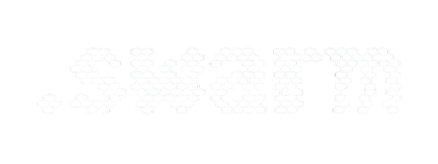

<div align="center">
  
  <h1>The .Swarm Protocol</h1>
  <p><strong>Minimal, git-native, markdown-first agent orchestration for multi-repo organizations.</strong></p>
</div>

---

## What's in the Box

dot_swarm is a layered toolkit. Every layer is opt-in — you can run the base protocol with zero dependencies, then add AI, security, roles, and federation only when you need them.

| Layer | Commands | Install |
|-------|----------|---------|
| **Core protocol** | `init` `status` `add` `claim` `done` `partial` `block` `ready` `handoff` | `pip install dot-swarm` |
| **Situational awareness** | `ls` `explore` `report` `audit` `heal` | base |
| **Scheduling & workflows** | `schedule` `workflow` | base |
| **Cross-repo federation** | `federation` | base |
| **Cryptographic signing** | auto — every `init` generates an identity | base |
| **AI operations** | `ai` `session` `configure` | `pip install 'dot-swarm[ai]'` |
| **Agent roles** | `role` `inspect` | base |
| **MCP server** | `dot-swarm-mcp` — Claude Code / Cursor / Windsurf native | base |

---

## The Problem: Multi-Agent Coordination

Modern software teams run multiple AI coding agents simultaneously — Claude Code, Cursor,
Windsurf, Gemini, opencode — across different repos and sessions. Without coordination:

- Two agents claim and implement the same task simultaneously
- Context is lost when a chat session ends or a context window is compacted
- Non-obvious decisions (why approach A over B) disappear with the session
- The next agent has no idea what the previous one did, decided, or left in-flight

Existing solutions require infrastructure that gets in the way:

- **Jira / Linear / GitHub Issues** — web UIs, API credentials, no agent-native format
- **Database-backed tools** — binary files, server processes, another thing to run
- **Slack bots / webhooks** — async, lossy, not git-auditable

**dot_swarm's answer: everything is a markdown file, living in the repo, readable and
writable by any agent on any platform with no credentials required.**

---

## Stigmergic Systems: Nature's Answer

In nature, central coordinators are rarely used — and when they exist, they do not
actively manage coordination.

A bee queen does not dispatch workers or resolve conflicts. She emits chemical markers
that encode colony state, and workers read those traces autonomously to decide what to
do next. An ant queen does the same. The result is not top-down management — it is
**multi-master consensus through a shared medium**. Hives split into independent
sub-colonies. Ant colonies form task-specialized sub-teams. Neither requires a central
node approving every action.

The key property that makes this work: **all members speak the same chemical language.**
Every worker interprets pheromone gradients the same way. The signal is the protocol.

dot_swarm applies this directly to software agent fleets:

!!! quote "The core principle"
    Agents that modify filesystem-native projects should leave traces in their
    environment for collaborative purposes, rather than reporting to a central node
    around which complicated systems must be arranged to prevent bottlenecks and
    data loss from information overload.

The `.swarm/` directory *is* the shared medium. `state.md` *is* the pheromone trail.
`BOOTSTRAP.md` *is* the chemical language every agent reads first.

**Signals decay.** `swarm audit` flags stale claims. `memory.md` entries are dated.
`state.md` timestamps tell any agent exactly how fresh the picture is.

---

## How It Works

### The `.swarm/` Directory

Every repository gets a `.swarm/` directory. Five files are the protocol core:

| File | Role |
|------|------|
| `BOOTSTRAP.md` | Universal agent protocol — every agent reads this first |
| `context.md` | What this project is, its constraints, its architecture |
| `state.md` | Current focus, active items, blockers, handoff note |
| `queue.md` | Work items with claim stamps |
| `memory.md` | Non-obvious decisions and rationale (append-only) |

Additional opt-in files: `trail.log` (signed audit), `schedules.md`, `workflows/`,
`federation/`, `roles/`.

### The Claim Pattern

Work items use inline stamps for optimistic concurrency — no lock server needed:

```markdown
## Active
- [>] [CLD-042] [CLAIMED · claude-code · 2026-03-26T14:30Z] Fix Redis timeout
      priority: high | project: cloud-stability

## Pending
- [ ] [CLD-043] [OPEN] Add request ID tracing to all services
      priority: medium | project: observability
      depends: CLD-042

## Done
- [x] [CLD-041] [DONE · 2026-03-25T16:00Z] Update auth health check path
      project: cloud-stability
```

### Dependency-Aware Work Discovery

`swarm ready` shows only items whose entire dependency chain is complete — equivalent
to `bd ready` in the Gastown/Beads ecosystem, but with no database required:

```bash
swarm ready          # list what's safe to pick up right now
swarm ready --json   # machine-readable, for agent scripts
```

### Hierarchical Coordination

```
Organization (your-company/)       ← cross-repo initiatives
  .swarm/
├── Division (service-a/)          ← single-repo work
│     .swarm/
└── Division (service-b/)
      .swarm/
```

Work items use level-prefixed IDs: `ORG-001`, `CLD-042`, `FW-017`. Cross-division items
live at org level with `refs:` pointers in each affected division's queue.

Use `swarm ascend` and `swarm descend` to check alignment across levels.

---

## Quick Start

=== "Project management only (no AI)"

    ```bash
    pip install dot-swarm

    cd your-repo
    swarm init                    # creates .swarm/ with signing identity
    swarm add "Fix auth timeout" --priority high
    swarm add "Add rate limiting" --depends CLD-001
    swarm ready                   # see what's unblocked
    swarm claim CLD-001
    # ... do work ...
    swarm done CLD-001 --note "Used exponential backoff"
    swarm handoff                 # structured summary for next agent/human
    ```

=== "With AI (AWS Bedrock)"

    ```bash
    pip install 'dot-swarm[ai]'
    swarm configure               # set model + region once

    # Single AI turn
    swarm ai "what should I work on next?"
    swarm ai "mark CLD-042 done, merged the OAuth PR"

    # Chained autonomous run
    swarm ai "implement the auth module, then the markets module" --chain --max-steps 6
    ```

=== "With MCP (Claude Code / Cursor / Windsurf)"

    ```bash
    pip install dot-swarm

    # Add to your MCP config (Claude Code: ~/.claude/mcp_config.json)
    # {
    #   "mcpServers": {
    #     "dot-swarm": {
    #       "command": "dot-swarm-mcp",
    #       "args": []
    #     }
    #   }
    # }

    # dot_swarm state is now available as MCP tools in your IDE agent
    # The agent can read queue, claim items, mark done — all natively
    ```

=== "With Agent Roles (multi-agent mode)"

    ```bash
    # Enable the inspector role — workers must prove completion
    swarm role enable inspector --max-iterations 3

    # Worker flow
    swarm claim CLD-042
    # ... implement feature, push branch ...
    swarm partial CLD-042 --proof "branch:feature/oauth2 commit:abc1234 tests:42/42"

    # Inspector flow (separate agent or human)
    swarm inspect CLD-042 --pass
    # or: swarm inspect CLD-042 --fail --reason "Edge case X fails"

    # See all roles
    swarm role list
    ```

---

## Why Not a Central Service?

| Central-node approach | Swarm approach |
|---|---|
| Agents report in, wait for assignments | Agents read environment, self-assign |
| Server becomes single point of failure | `.swarm/` files replicated by git |
| API credentials required per-agent | Plain file access, no auth layer |
| Context window dumps to external system | Context lives where the code lives |
| Bottleneck grows with fleet size | Throughput scales with number of agents |
| Complex de-duplication logic needed | Optimistic claims + audit resolves conflicts |

dot_swarm is distinct from Gastown/Beads in being **multi-master** (no Mayor
bottleneck), **feature-toggleable** (every layer is opt-in), and **federation-capable**
across separate repos and organizations via signed OGP-lite messages.

---

## Relationship to Gastown / Beads

dot_swarm and Gastown solve overlapping problems with different tradeoffs:

| | dot_swarm | Gastown + Beads |
|---|---|---|
| Storage | Markdown + git | Dolt (version-controlled SQL) + SQLite |
| Coordination model | Multi-master stigmergy | Single Mayor per colony |
| Feature toggles | Every layer opt-in | Fixed architecture |
| Cross-org federation | OGP-lite signed messages | Single workspace |
| IDE integration | MCP server (native) | tmux sessions |
| Agent roles | inspector / watchdog / supervisor / librarian | Mayor / Polecats / Refinery / Witness / Deacon |
| Dependencies | Zero (stdlib + click + mcp) | Dolt + SQLite3 + tmux |

Both are inspired by Steve Yegge's work and the broader stigmergy literature. dot_swarm
was specifically designed to work in environments where you cannot install a database.

---

## Security Model

Every `swarm init` generates a per-swarm HMAC-SHA256 signing identity. All AI
operations are signed and recorded in `trail.log`. `swarm audit --security` and
`swarm heal` scan for 18 adversarial content patterns across three severity levels
(CRITICAL / HIGH / MEDIUM) in all `.swarm/` files and platform shims.

See [CLI Reference → Security & Trust Model](CLI_REFERENCE.md#security-trust-model).

---

## Credits

Inspired by Steve Yegge's ["Welcome to Gas Town"](https://steve-yegge.medium.com/welcome-to-gas-town-4f25ee16dd04)
and grounded in stigmergy research spanning six decades, from Grassé's termite mound
studies (1959) through Dorigo's Ant Colony Optimization (1996) to Bonabeau, Dorigo &
Theraulaz's *Swarm Intelligence* (1999).

[Full credits and citations →](CREDITS.md)

---

## License

MIT — [github.com/oasis-main/dot_swarm](https://github.com/oasis-main/dot_swarm)
