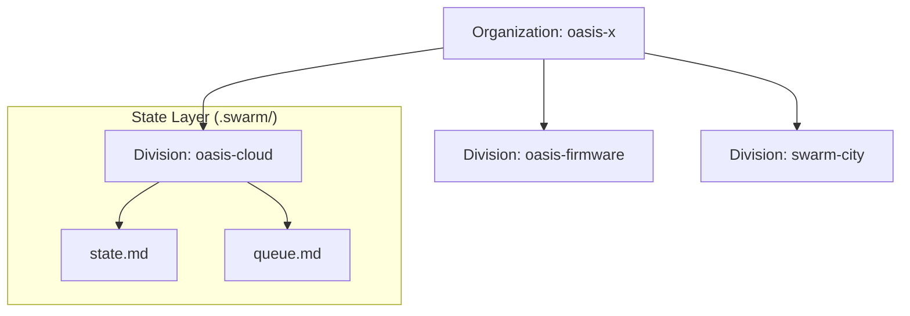
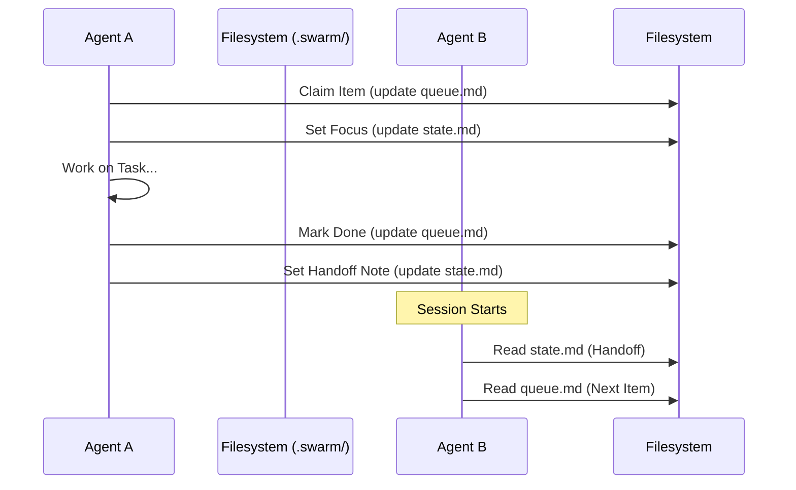
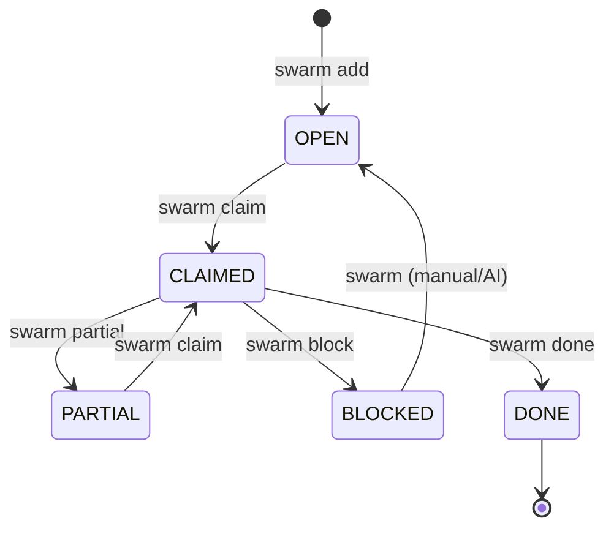

# dot_swarm — Implementation Bible

**Version**: 0.3.0
**Status**: Phase 1 (operational)
**Last updated**: 2026-03-30
**Author**: human-ML + claude-code

This document is the single source of truth for the dot_swarm project. It covers the
full architecture, all conventions, the CLI and MCP tool designs, implementation phases,
and handoff guides. Read this before starting any work on the tools.

---

## Table of Contents

1. [What dot_swarm Is](#1-what-dot_swarm-is)
2. [Relationship to Gastown](#2-relationship-to-gastown)
3. [Core Concepts](#3-core-concepts)
4. [Directory Structure](#4-directory-structure)
5. [File Formats and Conventions](#5-file-formats-and-conventions)
6. [Cross-Platform Agent Bootstrapping](#6-cross-platform-agent-bootstrapping)
7. [CLI Tool Design](#7-cli-tool-design)
8. [MCP Tool Design](#8-mcp-tool-design)
9. [Git Topology](#9-git-topology)
10. [CI/CD Documentation Drift Check](#10-cicd-documentation-drift-check)
11. [Implementation Phases](#11-implementation-phases)
12. [Session Handoff Guide](#12-session-handoff-guide)

---

## 1. What dot_swarm Is

dot_swarm is a **minimal, git-native, markdown-first agent orchestration layer** for
multi-repo software organizations. It replaces heavyweight issue trackers and
project management tools with a set of conventions, a small CLI, and an MCP server.

**What it provides:**
- Coordination state as plain markdown files in `.swarm/` directories
- A stigmergic protocol agents follow to pick up, execute, and hand off work
- A CLI tool for humans and CI systems to manage and audit the state
- An MCP server agents can call to read/write state atomically

**What it does not provide:**
- A web UI (read the files directly)
- A database (git history is the audit trail)
- A message bus or event system (state.md is the gossip mechanism)
- Enforcement (the protocol relies on agent discipline, backed by CI audit)

**Design philosophy:**
> The simplest system that makes agent handoffs reliable is the right system.
> Every agent on every platform should be able to orient in < 60 seconds by reading
> three markdown files.

---

## 2. Relationship to Gastown

**Gastown** is the name for the broader Oasis multi-agent orchestration vision —
the concept of multiple AI agents and human developers working asynchronously across
a repo ecosystem, with stigmergic coordination. Prior attempts used "Beads" (a Dolt-
based issue tracker), which failed due to:
- Git pollution from Dolt artifacts (PID, lock, log, credential files)
- A second sync layer on top of git
- Non-standard vocabulary
- Binary state that agents couldn't read directly

**dot_swarm** is the first reference implementation of the Gastown architecture that's
worth keeping. It reuses Gastown concepts (pheromone trails, claim patterns, hierarchical
coordinators) but implements them purely in markdown + git.

Gastown continues as the conceptual umbrella. Future implementations (with schedulers,
UIs, or event buses) would be "Gastown architectures." dot_swarm is the minimal baseline.

---

## 3. Core Concepts

### Organization / Division / (future: Team)



There is intentionally no "team" level in Phase 0. If a product family needs its own
coordinator (e.g., all cloud-related repos), add a `towns/<family>/` subdirectory
inside org `.swarm/`. Do not add this until there is a real need.

### The Pheromone Trail (state.md)

Borrowed from ant colony optimization: agents leave chemical traces (state.md updates)
that guide successor agents. `state.md` is always short (< 20 lines), always current,
and always the first thing an agent reads after `context.md`. It decays if not updated —
the CI audit detects this "drift."

### Stigmergic Coordination

Agents do not communicate directly. They communicate through shared state (the `.swarm/`
files). This means:
- Multiple agents can be active in different divisions simultaneously
- No central dispatcher is required
- A new agent can orient fully from the filesystem, without talking to any service



### The Claim Pattern

Work items use inline stamps rather than a separate lock database:



`[OPEN] → [CLAIMED · claude-code · 2026-03-26T14:30Z] → [DONE · 2026-03-26T16:45Z]`

---

## 4. Directory Structure

### Org Level

```
oasis-x/
├── .swarm/
│   ├── BOOTSTRAP.md         # Universal agent protocol (read this first)
│   ├── ROUTING.md           # Level attribution decision tree
│   ├── GLOSSARY.md          # Terminology reference
│   ├── context.md           # Org charter (stable)
│   ├── state.md             # Current org focus (volatile)
│   ├── queue.md             # Org-level work items
│   ├── memory.md            # Org-level decisions + rationale
│   └── workflows/
│       ├── agent-session.md # Standard agent session protocol
│       ├── new-feature.md   # Feature development workflow
│       ├── bug-fix.md       # Bug fix workflow
│       └── cross-division.md# Cross-division coordination
├── swarm-city/              # This project (CLI + MCP source)
│   ├── README.md            # This file (the bible)
│   ├── cli/                 # dot_swarm CLI tool
│   ├── mcp/                 # dot_swarm MCP server
│   └── docs/                # Additional documentation
└── AGENTS.md                # Updated to point at .swarm/BOOTSTRAP.md
```

### Division Level (each git repo)

```
oasis-cloud/
├── .swarm/
│   ├── BOOTSTRAP.md         # Symlink or copy of org BOOTSTRAP (or one-liner pointer)
│   ├── context.md           # This division's charter
│   ├── state.md             # This division's current state
│   ├── queue.md             # This division's work items
│   └── memory.md            # This division's decisions
├── CLAUDE.md                # One-liner: "See @.swarm/BOOTSTRAP.md"
├── .windsurfrules           # One-liner pointing to .swarm/BOOTSTRAP.md
└── .cursorrules             # One-liner pointing to .swarm/BOOTSTRAP.md
```

---

## 5. File Formats and Conventions

### Item ID Format

`<DIVISION-CODE>-<zero-padded-3-digit-number>`

Examples: `ORG-001`, `CLD-042`, `SWC-007`

IDs are assigned sequentially within each division and never reused. The CLI's
`swarm add` command auto-assigns the next available ID.

Division codes are defined in `.swarm/BOOTSTRAP.md` and `GLOSSARY.md`.

### queue.md Structure

```markdown
# Queue — <division> (<level>)

## Active
- [>] [<ID>] [CLAIMED · <agent> · <ISO8601>] <description>
      priority: <critical|high|medium|low> | project: <project-name>
      [notes: <optional notes>]
      [depends: <ID>, <ID>]
      [refs: <path>#<ID>]

## Pending
- [ ] [<ID>] [OPEN] <description>
      priority: <...> | project: <...>

## Done
- [x] [<ID>] [DONE · <ISO8601>] <description>
      project: <...>
```

Rules:
- Items in Active have been claimed (move here from Pending when claimed)
- Items in Pending are OPEN and sorted by priority
- Items in Done are kept for history (never deleted)
- Use `[>]` checkbox syntax for active items (visual indicator)
- The `priority` and `project` fields are machine-readable — the CLI parses them

### state.md Structure

```markdown
# State — <division>

**Last touched**: <ISO8601> by <agent-id>
**Current focus**: <one-line description>
**Active items**: <ID>, <ID>
**Blockers**: <None | description>
**Ready for pickup**: <ID>, <ID>

---

## Handoff Note

<1-3 sentences for the next agent>

---

## Division State Snapshot (org only)

| Division | State file | Last known focus |
...
```

### context.md Structure

```markdown
# Context — <division>

**Level**: <Organization | Division>
**Coordinator path**: <relative path to .swarm/>
**Last updated**: <YYYY-MM-DD>

## What <division> Is
<paragraph>

## Architecture Constraints
<numbered list>

## Current Focus Areas
<numbered list>

## Key Reference Documents
<list with paths>
```

### memory.md Structure

```markdown
# Memory — <division>

## <YYYY-MM-DD> — <topic> (<agent-id>)

**Decision**: <what was decided>
**Why**: <rationale>
**Trade-off accepted**: <what was given up>
```

---

## 6. Cross-Platform Agent Bootstrapping

### The Problem

Every agent platform loads a different "magic file":
- Claude Code: `CLAUDE.md`
- Windsurf: `.windsurfrules`
- Cursor: `.cursorrules`
- Gemini CLI: system prompt config
- OpenCode: agent rules file

Maintaining divergent protocols in each leads to drift.

### The Solution

**Single canonical source (`BOOTSTRAP.md`) + thin platform shims.**

Each platform shim is a one-liner that points agents at `.swarm/BOOTSTRAP.md`. When the
protocol changes, only `BOOTSTRAP.md` needs updating.

### Platform Shim Templates

See `docs/PLATFORM_SETUP.md` for copy-paste templates. Quick reference:

**CLAUDE.md** (Claude Code):
```markdown
Before starting any work, read @.swarm/BOOTSTRAP.md and follow the protocol exactly.
Active context: @.swarm/context.md | State: @.swarm/state.md | Queue: @.swarm/queue.md
```

**.windsurfrules** (Windsurf):
```
Before starting any task, read the file .swarm/BOOTSTRAP.md and follow its protocol.
Do not begin work without claiming an item in .swarm/queue.md and updating .swarm/state.md.
```

**.cursorrules** (Cursor):
```
Always begin every session by reading .swarm/BOOTSTRAP.md.
Follow the On Start, During Work, and On Stop sections exactly.
```

**Gemini CLI / OpenCode** — these require configuring a system prompt fragment.
Copy the full text of `BOOTSTRAP.md` into the platform's system prompt config,
or add a file-read instruction pointing at `.swarm/BOOTSTRAP.md`.

### Division-Level BOOTSTRAP.md

Each division's `.swarm/BOOTSTRAP.md` can either be:
1. A copy of the org-level BOOTSTRAP.md (simplest — run `swarm init` to create)
2. A one-liner pointer: `See oasis-x/.swarm/BOOTSTRAP.md for the full protocol.`
3. A division-specific variant (for divisions with unusual workflows)

Option 2 is preferred during Phase 0. The CLI's `swarm init` creates option 2 by default.

---

## 7. CLI Tool Design

### Overview

The `swarm` CLI is a Python tool installed into the local Python environment or as a
global binary. It manages `.swarm/` files, enforces conventions, and provides audit
capabilities.

**Language**: Python 3.11+
**Framework**: Click (consistent with existing oasis tooling)
**Location**: `src/swarm_city/`
**Install**: `pip install -e .`

### Command Reference

```
swarm [OPTIONS] COMMAND [ARGS]

Options:
  --level TEXT    Override level detection (org|div)
  --path TEXT     Path to operate on (default: cwd)
  --format TEXT   Output format (table|json|md) default: table
  -v, --verbose   Verbose output

Commands:
  init      Initialize .swarm/ in current directory
  status    Show current state (summary across all divisions or current div)
  claim     Claim a work item
  done      Mark a work item as done
  add       Add a new work item
  partial   Mark a claimed item as partially complete (safe for re-claim)
  block     Mark a work item as blocked with a reason
  audit     Check for drift: stale claims, missing state updates, orphaned refs
  ls        List work items with optional filters
  handoff   Generate a handoff summary (current state + next ready items)
  sync      Refresh state snapshot in org state.md from all division state files
  explore   Show the heartbeat of all divisions in the colony
  ai        Natural language interface (configurable context limit)
  history   Show git log filtered to .swarm/ changes
```

### Command Specs

#### `swarm explore`

```
swarm explore [--depth 2] [--path .]
```

Recursively discovers all `.swarm/` directories in the subtree and displays a unified
"Colony Heartbeat" table. This is the primary human-facing discovery tool for
multi-repo organizations.

Output:
- Division name (with ★ for org level)
- Last touched (timestamp)
- Current focus
- Activity summary (number of active/pending items)

#### `swarm ai`

```
swarm ai "instruction" [--limit 1200] [--yes]
```

Translates natural language into atomic `.swarm/` file operations.
- `--limit`: Adjust the approximate token limit for the context bundle. High limits (e.g., 6000) allow the AI to see more of the queue and context, but increase cost/latency. Default is 1200.

---

## 8. Visualization Strategy: The Stigmergic Heartbeat

```
swarm status [--division DIV-CODE] [--all]
```

At org level: table of all divisions with their current state.md summary.
At div level: current state.md + next 3 OPEN items from queue.md.
`--all`: full queue.md dump.

Output example:
```
Organization: oasis-x | Updated: 2026-03-26T00:00Z by human-ML
Focus: dot_swarm bootstrap — scaffolding .swarm/ structure

Division     Last Touched              Focus
──────────── ──────────────────────── ────────────────────────────────
oasis-cloud  2026-03-25T10:00Z        Not yet bootstrapped (Phase 1 pending)
oasis-fw     2026-03-24T18:00Z        Not yet bootstrapped (Phase 1 pending)
swarm-city   2026-03-26T00:00Z        Phase 0 scaffolding active

Pending (org): ORG-002 (CLI tool), ORG-003 (MCP server), ORG-004 (div stubs)
```

#### `swarm claim <id>`

```
swarm claim ORG-002 [--agent claude-code] [--path .]
```

- Reads `queue.md`, finds the item by ID
- Changes `[OPEN]` → `[CLAIMED · <agent> · <ISO8601>]`
- Moves item to Active section
- Updates `state.md` Current focus field
- Prints confirmation

Agent ID defaults to:
1. `$SWARM_AGENT_ID` env var
2. `$USER` with `human-` prefix
3. Prompted interactively

#### `swarm done <id>`

```
swarm done ORG-002 [--note "brief completion note"]
```

- Changes `[CLAIMED ...]` → `[DONE · <ISO8601>]`
- Moves item to Done section
- Updates `state.md` (clears item from Active items, sets Handoff note)
- Prompts: "What's the next item to highlight in state.md?"

#### `swarm add "<description>"`

```
swarm add "Fix Redis timeout in sentinel" [--priority high] [--project cloud-stability] [--refs ORG-009]
```

- Auto-assigns next available ID for current division (reads last ID from queue.md)
- Appends to Pending section in correct priority order
- Prints assigned ID

#### `swarm audit`

```
swarm audit [--all] [--since 48h]
```

Checks:
1. **Stale claims**: Items `[CLAIMED]` for > 48h without a state.md update → warns
2. **Drift**: `state.md` Last touched > 72h ago in any division → warns
3. **Orphaned refs**: `refs:` pointers in queue items that point to non-existent IDs
4. **Unclaimed blockers**: `[BLOCKED]` items with no human acknowledgment > 24h

Output: table of issues with severity (WARN / ERROR) and suggested action.

#### `swarm handoff`

```
swarm handoff [--format md|text]
```

Generates a handoff document suitable for pasting into a new agent chat:

```markdown
# dot_swarm Handoff — oasis-x — 2026-03-26T14:30Z

## Current State
Focus: dot_swarm Phase 0 scaffolding
Agent: human-ML
Active: ORG-001 (in progress — .swarm/ files being created)

## Ready for Pickup
- ORG-002: Implement dot_swarm CLI tool [HIGH]
- ORG-003: Implement dot_swarm MCP server [HIGH]
- ORG-004: Create division-level .swarm/ stubs [HIGH]

## Context Files to Load
- @oasis-x/.swarm/BOOTSTRAP.md
- @oasis-x/.swarm/context.md
- @oasis-x/swarm-city/README.md (full implementation bible)
```

#### `swarm sync`

```
swarm sync [--dry-run]
```

Reads `state.md` from each known division and refreshes the Division State Snapshot
table in org `state.md`. Run this after multiple divisions have been updated.

Detects division paths from `context.md`'s Active Divisions table.

### Implementation Notes

- **Atomic writes**: All queue.md edits use write-to-tmp + rename to avoid partial writes
- **ID parsing**: Use regex `\[([A-Z]+-\d+)\]` to find item IDs in queue.md
- **Timestamp**: Always ISO 8601 UTC with Z suffix: `datetime.utcnow().strftime('%Y-%m-%dT%H:%MZ')`
- **Section detection**: Parse queue.md sections by `## Active`, `## Pending`, `## Done` headers
- **No external dependencies** besides Click and standard library (for portability)

---

## 8. MCP Tool Design

### Overview

The dot_swarm MCP server exposes all `.swarm/` operations as tools that any MCP-
compatible agent platform can call. This is the preferred way for agents to interact
with dot_swarm when an MCP connection is available — it handles atomic writes and
provides structured responses.

**Language**: Python 3.11+
**Framework**: `mcp` (Model Context Protocol Python SDK)
**Transport**: stdio (default) or SSE
**Location**: `src/swarm_city_mcp/`
**Install**: `pip install -e .`

### Configuration (per platform)

**Claude Code** (`~/.claude/settings.json` or project settings):
```json
{
  "mcpServers": {
    "swarm-city": {
      "command": "python",
      "args": ["-m", "swarm_city_mcp.server"],
      "env": {
        "SWARM_ROOT": "/path/to/oasis-x"
      }
    }
  }
}
```

**Windsurf / Cursor**: Configure via their MCP settings panel.
See `docs/PLATFORM_SETUP.md` for platform-specific instructions.

### Tool Reference

#### `swarm_bootstrap`
```
swarm_bootstrap(path: str = ".") -> str
```
Returns the contents of `BOOTSTRAP.md` for the given path (walks up to find `.swarm/`).
Use this as the first call in any session to get the current protocol.

#### `swarm_context`
```
swarm_context(path: str = ".") -> str
```
Returns `context.md` for the `.swarm/` directory nearest to `path`.

#### `swarm_state`
```
swarm_state(path: str = ".", write: bool = False, fields: dict = None) -> str
```
Read or write `state.md`.
- `write=False`: returns current state.md contents
- `write=True, fields={"current_focus": "...", "handoff_note": "..."}`:
  updates specified fields in state.md, returns updated contents.

Writable fields: `current_focus`, `active_items`, `blockers`, `ready_for_pickup`,
`handoff_note`, `last_touched` (auto-set to now if write=True).

#### `swarm_queue`
```
swarm_queue(
  path: str = ".",
  section: str = "all",    # "active"|"pending"|"done"|"all"
  priority: str = None,    # filter by priority
  project: str = None,     # filter by project
  id: str = None           # get specific item
) -> list[dict]
```
Returns list of work items as structured dicts:
```json
[{
  "id": "ORG-002",
  "state": "OPEN",
  "description": "Implement dot_swarm CLI tool",
  "priority": "high",
  "project": "swarm-city-tooling",
  "claimed_by": null,
  "claimed_at": null,
  "refs": []
}]
```

#### `swarm_claim`
```
swarm_claim(id: str, agent_id: str, path: str = ".") -> dict
```
Atomically claims a work item. Returns the updated item dict.
Raises error if item is already claimed by a different agent.

#### `swarm_done`
```
swarm_done(id: str, agent_id: str, note: str = None, path: str = ".") -> dict
```
Marks an item done, moves it to Done section. Updates state.md if agent matches
current `active_items`.

#### `swarm_add`
```
swarm_add(
  description: str,
  priority: str = "medium",
  project: str = "misc",
  notes: str = None,
  refs: list[str] = None,
  depends: list[str] = None,
  path: str = "."
) -> dict
```
Adds a new work item. Auto-assigns next available ID. Returns new item dict.

#### `swarm_append_memory`
```
swarm_append_memory(
  topic: str,
  decision: str,
  why: str,
  tradeoff: str = None,
  agent_id: str = "unknown",
  path: str = "."
) -> str
```
Appends a formatted memory entry to `memory.md`. Returns the appended text.

#### `swarm_audit`
```
swarm_audit(path: str = ".", since_hours: int = 48) -> list[dict]
```
Returns list of audit findings:
```json
[{
  "severity": "WARN",
  "type": "stale_claim",
  "item_id": "CLD-042",
  "message": "Claimed 72h ago by claude-code, no state update",
  "suggested_action": "Re-evaluate or mark PARTIAL"
}]
```

#### `swarm_handoff`
```
swarm_handoff(path: str = ".", format: str = "md") -> str
```
Generates a handoff document. Same output as `swarm handoff` CLI.

### Implementation Notes

- Use `anyio` for async file I/O within the MCP server
- The server is stateless — all state is on-disk in `.swarm/` files
- Use file locking (`fcntl.flock` on Unix) for atomic writes to queue.md
- Path resolution: always walk up from the given path until `.swarm/` is found,
  or return an error if not found within 5 parent directories
- Log all write operations to a per-session append-only log at
  `.swarm/.mcp-session-<date>.log` (gitignored) for debugging

---

## 9. Git Topology

### Current State

`oasis-x/` is not a git repository. Division repos are independent git repos.

### Phase 0 (current): No git at org level

`.swarm/` files exist on the filesystem but are not version-controlled at org level.
This is acceptable for Phase 0 — focus is on getting the protocol right.

### Phase 1 Goal: Thin org-level git repo

Initialize `oasis-x` as a git repo that tracks ONLY `.swarm/` and `swarm-city/`:

```bash
cd oasis-x/
git init
cat > .gitignore << 'EOF'
# Track only .swarm/ coordination state and swarm-city/ project
*
!.swarm/
!.swarm/**
!swarm-city/
!swarm-city/**
!.gitignore
!AGENTS.md
EOF
git add .swarm/ swarm-city/ .gitignore AGENTS.md
git commit -m "chore: initialize dot_swarm coordination layer"
```

This gives:
- Full git history on all `.swarm/` state changes (who claimed what, when)
- Org-level PRs for org-level initiatives
- No submodule overhead — division repos stay independent
- The org git repo is lightweight (only markdown files)

### Division repos

Division repos track their own `.swarm/` as part of their normal git history.
No changes needed to existing git setup.

### Cross-repo auditing

The CI/CD drift check (see section 10) uses GitHub API to read division `.swarm/state.md`
files from their respective repos. No git submodules needed.

---

## 10. CI/CD Documentation Drift Check

### Purpose

When code changes are pushed to a division repo, a GitHub Action checks whether
the division's `.swarm/state.md` and `.swarm/queue.md` accurately reflect those changes.
It calls Bedrock (Claude) to generate a natural-language assessment and posts it as a
PR comment.

### Workflow File Location

`oasis-cloud-admin/.github/workflows/swarm-drift-check.yml`
(The admin repo is the control plane — CI/CD lives here.)

Or per-division at `<repo>/.github/workflows/swarm-drift-check.yml`.

### Workflow Spec

```yaml
name: dot_swarm Drift Check

on:
  pull_request:
    types: [opened, synchronize]
  push:
    branches: [dev, prod]

jobs:
  drift-check:
    runs-on: ubuntu-latest
    permissions:
      pull-requests: write
      contents: read

    steps:
      - uses: actions/checkout@v4
        with:
          fetch-depth: 0  # need full history for diff

      - name: Get changed files
        id: changes
        run: |
          git diff --name-only origin/${{ github.base_ref }}...HEAD > /tmp/changed_files.txt
          cat /tmp/changed_files.txt

      - name: Read .swarm state
        run: |
          cat .swarm/state.md > /tmp/state.md 2>/dev/null || echo "(no state.md)" > /tmp/state.md
          cat .swarm/queue.md > /tmp/queue.md 2>/dev/null || echo "(no queue.md)" > /tmp/queue.md

      - name: Get diff summary
        run: |
          git diff origin/${{ github.base_ref }}...HEAD -- '*.py' '*.ts' '*.rs' \
            | head -500 > /tmp/diff.txt

      - name: Check drift with Bedrock
        id: drift
        env:
          AWS_ACCESS_KEY_ID: ${{ secrets.AWS_ACCESS_KEY_ID }}
          AWS_SECRET_ACCESS_KEY: ${{ secrets.AWS_SECRET_ACCESS_KEY }}
          AWS_DEFAULT_REGION: us-east-1
        run: |
          python3 - << 'PYEOF'
          import boto3, json, sys

          bedrock = boto3.client('bedrock-runtime', region_name='us-east-1')

          diff = open('/tmp/diff.txt').read()[:3000]
          state = open('/tmp/state.md').read()
          queue = open('/tmp/queue.md').read()[:2000]
          changed = open('/tmp/changed_files.txt').read()

          prompt = f"""You are reviewing a pull request for documentation drift in a dot_swarm-coordinated repository.

          dot_swarm uses .swarm/state.md and .swarm/queue.md to track agent coordination state.

          Changed files in this PR:
          {changed}

          Current .swarm/state.md:
          {state}

          Current .swarm/queue.md (first 2000 chars):
          {queue}

          Code diff (first 3000 chars):
          {diff}

          Check:
          1. Does state.md's "Current focus" reflect what these code changes implement?
          2. Are the relevant work items in queue.md marked as [DONE] or [CLAIMED]?
          3. Are there new items that should be added to queue.md based on TODOs or incomplete work?
          4. Does memory.md need a new entry for any non-obvious decisions in this diff?

          Respond in markdown. Be specific about line references when flagging issues.
          If everything looks good, say so briefly. Maximum 300 words."""

          response = bedrock.invoke_model(
              modelId='anthropic.claude-sonnet-4-6',
              body=json.dumps({
                  'anthropic_version': 'bedrock-2023-05-31',
                  'max_tokens': 500,
                  'messages': [{'role': 'user', 'content': prompt}]
              })
          )
          result = json.loads(response['body'].read())
          assessment = result['content'][0]['text']

          with open('/tmp/drift_assessment.md', 'w') as f:
              f.write(f"## dot_swarm Drift Check\n\n{assessment}")
          PYEOF

      - name: Post PR comment
        if: github.event_name == 'pull_request'
        uses: actions/github-script@v7
        with:
          script: |
            const fs = require('fs');
            const body = fs.readFileSync('/tmp/drift_assessment.md', 'utf8');
            await github.rest.issues.createComment({
              owner: context.repo.owner,
              repo: context.repo.repo,
              issue_number: context.payload.pull_request.number,
              body
            });
```

### Adding to Each Division

Once the workflow is tested in one repo, add to each division's `.github/workflows/`.
The `swarm init` command will eventually create this file automatically.

---

## 11. Implementation Phases

### Phase 0 — Scaffold (CURRENT)
**Goal**: Org-level `.swarm/` structure exists and is usable by agents today.
**Status**: In progress

- [x] Design dot_swarm architecture
- [x] Create org-level `.swarm/BOOTSTRAP.md`
- [x] Create org-level `.swarm/ROUTING.md`
- [x] Create org-level `.swarm/GLOSSARY.md`
- [x] Create org-level `.swarm/context.md`
- [x] Create org-level `.swarm/state.md`
- [x] Create org-level `.swarm/queue.md`
- [x] Create org-level `.swarm/memory.md`
- [x] Create `.swarm/workflows/agent-session.md`
- [x] Create `.swarm/workflows/cross-division.md`
- [x] Create `README.md` (root level)
- [x] Unify `src/swarm_city` and `src/swarm_city_mcp` into single package
- [x] Create `docs/PLATFORM_SETUP.md` (shim templates)
- [x] Update `oasis-x/AGENTS.md` to point at `.swarm/BOOTSTRAP.md`

**Handoff**: Phase 0 scaffolding is essentially complete. The core models and file operations are implemented, and the CLI/MCP server can be installed from the root directory.

---

### Phase 1 — Division Bootstrapping
**Goal**: All active divisions have `.swarm/` stubs and platform shims.
**Depends on**: Phase 0 complete

- [x] `swarm init` logic for file creation and level detection
- [ ] Roll out to divisions: oasis-cloud, oasis-cloud-admin, oasis-weather, oasis-firmware,
      oasis-home, oasis-ui, oasis-forms, oasis-hardware, oasis-welcome
- [ ] Populate each division's `context.md` from existing AGENTS.md content
- [ ] Add platform shims to each division (CLAUDE.md, .windsurfrules, .cursorrules)
- [ ] Migrate any relevant Beads issues to division queue.md files

---

### Phase 2 — CLI Tool (Enhanced)
**Goal**: `swarm` command works for all core operations.
**Status**: Mostly complete

- [x] `swarm status` (state summary)
- [x] `swarm claim` / `swarm done` / `swarm partial` / `swarm block`
- [x] `swarm add` (ID auto-assignment)
- [x] `swarm audit` (stale claim detection, drift detection)
- [x] `swarm handoff` (handoff doc generation)
- [x] `swarm ai` (Natural language to swarm ops)
- [ ] `swarm sync` (org state snapshot refresh)
- [ ] Unit tests for queue.md parsing
- [x] Unified `pyproject.toml` for easy distribution

---

### Phase 3 — MCP Server (Enhanced)
**Goal**: `swarm_*` tools available in all MCP-compatible platforms.
**Status**: Mostly complete

- [x] MCP server implementation using unified models/operations
- [x] Support for all core operations: claim, done, add, state, queue, context
- [ ] File locking for atomic writes (verify implementation)
- [x] Platform setup docs (Claude Code, Windsurf, Cursor, Gemini, OpenCode)
- [x] Test with Claude Code MCP config

---

### Phase 4 — CI/CD + Git Topology
**Goal**: Drift check runs on every PR. Org has git history.
**Depends on**: Phase 1

- [ ] Add `swarm-drift-check.yml` to oasis-cloud-admin (test on one repo first)
- [ ] Roll out to all active division repos
- [ ] Initialize `oasis-x` as thin git repo (track .swarm/ + swarm-city/ only)
- [ ] First commit of all Phase 0–1 .swarm/ files
- [ ] Configure GitHub repo for oasis-x (org visibility)

---

### Phase 5 — Remove Beads
**Goal**: No `.beads/` directories anywhere.
**Depends on**: Phase 1

- [ ] Export Beads JSONL backup: `bd export --output .beads/backup/`
- [ ] Archive JSONL files in `swarm-city/archive/beads-migration/`
- [ ] Delete `.beads/` from oasis-home
- [ ] Uninstall `bd` CLI globally
- [ ] Remove `.beads/` from any other repos if present

---

## 12. Session Handoff Guide

This section is specifically for picking up dot_swarm work across sessions.

### Starting a New Session on dot_swarm

1. Read this file (README.md) from top to bottom — or at minimum sections 3, 4, 11.
2. Read `oasis-x/.swarm/state.md` for current focus.
3. Read `oasis-x/.swarm/queue.md` for available items.
4. Claim the next available ORG or SWC item.

### The Most Important Files

```
oasis-x/.swarm/BOOTSTRAP.md     ← protocol every agent follows
oasis-x/.swarm/queue.md          ← what needs doing
oasis-x/.swarm/state.md          ← where things stand right now
oasis-x/README.md                ← root project overview
oasis-x/docs/ARCHITECTURE.md     ← this file (the bible)
oasis-x/docs/PLATFORM_SETUP.md   ← platform specific shims
```

### Implementing the CLI / MCP (pickup)

Source code lives in `src/`:
- `src/swarm_city/cli.py`           ← Click commands
- `src/swarm_city/models.py`        ← Shared data models
- `src/swarm_city/operations.py`    ← Atomic file operations
- `src/swarm_city_mcp/server.py`    ← MCP tool wrappers

The CLI and MCP server share the same data models and operation logic. To install locally:
`pip install -e .`

To test the MCP server:
`python -m swarm_city_mcp.server`

### Known Issues / Gotchas

- The queue.md format must be parsed with regex, not markdown parsers (they don't
  handle the inline stamp syntax reliably). See `operations.py` for the regex patterns.
- `state.md` has a fixed field structure. Use line-by-line replacement, not YAML parsing.
- For division-level BOOTSTRAP.md, the pointer approach (option 2) is preferred over
  copying to avoid protocol drift when BOOTSTRAP.md is updated.
- The `swarm audit` stale threshold (48h) is configurable via `SWARM_STALE_HOURS` env var.

---

## Design Roadmap

Per-swarm operational queues live in `.swarm/queue.md` (item IDs `SWC-NNN`). The
items below are larger architectural threads — each one is also tracked as a
queue item but warrants design-level discussion here.

### Swarm Key — AEAD-encrypted trail (queue: SWC-046, Phase 1 shipped)

**Phase 1 status: shipped in v1.0.** `swarm key init` generates a per-swarm
ChaCha20-Poly1305 key (`.swarm/.swarm_key`, 256-bit, gitignored). When
present, every entry written to `trail.log` is sealed as a one-line
``swae1:<urlsafe-b64 of nonce(12) || ciphertext || tag(16)>`` envelope —
opaque on disk to anyone without the key, transparently decrypted by
`read_trail` and the `swarm` CLI. Trails written before key adoption stay
readable as plaintext alongside the new envelopes; adopting a key does
not invalidate prior history.

`swarm key rotate` generates a new key, retains the prior one as
`.swarm_key.old`, and re-seals every existing envelope under the new key
in a single sweep. Mid-rotation reads transparently fall back to the old
key; once the rewrap is verified the operator deletes `.swarm_key.old`.

`swarm key seal <file>` and `swarm key open <file>` provide explicit
file-level encryption for any coordination file (e.g. archived `memory.md`
snapshots) without requiring auto-encryption of the human-readable working
files. Phases 2 and 3 (transparent decrypt at the resolver layer for
`memory.md` / `state.md` writes; federation key exchange) remain ahead.

#### Original design rationale

The fundamental objection to stigmergic coordination is that the shared medium
is, by definition, shared. The biological version of this problem was solved a
long time ago: ants and bees recognize nestmates by colony-specific chemical
signatures (cuticular hydrocarbons, comb-wax esters), and the response to a
foreign signature is reflexive and fast. The signal carries identity *as part
of the chemistry*.

The **swarm key** brings that property to the trail. `swarm init` generates a
per-swarm symmetric key (XChaCha20-Poly1305, 256-bit) alongside the existing
HMAC signing key. All writes to coordination files are sealed with AEAD before
being persisted.

This produces three architectural shifts:

1. **Confidentiality of the medium without giving up its publicness.** The
   trail can live in git, in shared filesystems, in pushed branches, and remain
   opaque to anyone without the swarm key. `swarm trail visible` becomes safe
   by default rather than a tradeoff.
2. **Forgery becomes structurally impossible from outside.** AEAD tag failure
   on read is binary, fast, and per-record. A process without the key cannot
   write a record any honest reader will accept; it can only write obviously
   invalid records, which `swarm heal` quarantines as CRITICAL on contact.
3. **Federation gets a clean primitive.** Inter-swarm trust currently relies on
   file-based OGP-lite signed messages. With swarm keys, federation becomes
   key exchange under Doorman policy, replacing the transport-layer scheme
   with authenticated channels.

What it does not solve: a *legitimate* agent that holds the swarm key and
writes poisoned content. AEAD prevents forgery from outside, not betrayal from
inside. The 18-pattern adversarial scanner remains the layer responsible for
that case — same as biology, where a worker that has gone rogue still smells
right.

Phasing:

- **Phase 1.** Key generation in `swarm init`, `swarm key rotate`, AEAD on
  `trail.log`. HMAC signing identity stays — it serves a separate purpose
  (binding a record to a specific agent inside an already-decrypted trail).
- **Phase 2.** Extend AEAD to `memory.md`, `state.md` decision entries, and
  claim notes. Transparent decryption in CLI reads when the key is present.
- **Phase 3.** Federation: swarm-to-swarm key exchange (or per-channel
  sub-keys) under Doorman policy.

Cross-references: README → "Coming: encrypted trails and the swarm key";
docs/SECURITY.md → "Roadmap: the swarm key".

### Append-only claim trail (queue: SWC-033)

`.swarm/claims/` is the canonical record of every lifecycle transition on
every work item. Every call to `claim`, `partial`, `done`, `block`,
`reopen`, or `compete` appends one immutable JSON record to this directory
— prior records are never overwritten or deleted. State changes that look
like mutations in `queue.md` (CLAIMED → DONE, COMPETING → CLAIMED) are
expressed in the trail as *new* records that supersede earlier ones.

The resolver in `operations.resolve_claims` is the single point that
collapses the trail back into a per-item state for human-friendly
rendering:

1. For each `(item_id, agent_id)` pair, keep only the newest record.
2. Per item, partition the per-agent records into terminal states
   (`DONE`, `BLOCKED`, `CANCELLED`) and active states (`CLAIMED`,
   `PARTIAL`, `COMPETING`, `REVIEW`).
3. A terminal record that is at least as new as every active record on
   that item wins — the item is rendered in its terminal state.
4. Otherwise, count the active agents. Zero active → the item is
   `OPEN` again. One active → use that agent's state. Two or more
   active → `COMPETING`, with all claimants surfaced.

This gives three properties that matter for git-native multi-agent work:

- **No merge conflicts** on `.swarm/claims/` itself — every record lives
  in its own filename, so concurrent claims by separate workers produce
  separate files rather than competing edits to a shared file.
- **Forensic completeness** — `swarm trail claims [--item ID]` shows
  every state every agent ever asserted, with timestamps. Nothing is
  silently rewritten.
- **Concurrent-safe COMPETING aggregation** — multiple workers writing
  active records on the same item don't fight over `queue.md`; the
  resolver simply reports them as competitors.

### Competing claimants (queue: SWC-039)

Multiple agents can hold an active claim on the same item simultaneously.
The trail records every claim independently; `competitors_for(paths,
item_id)` lists everyone whose latest record is in
`{CLAIMED, COMPETING, PARTIAL, REVIEW}`. Resolution to a winner is an
explicit, auditable step rather than a silent overwrite:

```bash
swarm compete list API-042              # who is currently in the running
swarm compete winner API-042 agent-B \  # promote one; record losers as withdrawn
    --reason "passes burst-traffic edge case"
```

`promote_competitor` writes a fresh `CLAIMED` record for the winner and
an `OPEN` record for each loser tagged `lost-competition: winner=<id>`.
The trail therefore preserves the full history of *who tried what,
when, and why one was chosen* — useful both for inspector retros and for
training data on which agent specializes in which kind of work.

### Hidden-in-plain-sight stigmergy: seals (`dot_swarm.seals`)

A *seal* is a short HMAC tag embedded inline in coordination markdown as
an HTML comment::

    <!-- 🐝 sw-seal v1 <agent>:<hex8> -->

The tag is the first 8 hex chars of `HMAC-SHA256(swarm_key, version ||
agent_id || normalized_content)`. To outside readers it looks like an
ordinary trailing comment in plain markdown; to an agent holding the
swarm signing key, it authenticates the writer of the surrounding
content and detects tampering on read.

This is the integrity layer that the AEAD swarm key (SWC-046) does not
provide, and vice versa:

| Layer        | What it protects                | Visible to outsiders? |
|--------------|---------------------------------|-----------------------|
| Seals        | integrity + writer attribution  | yes (markdown stays human-readable) |
| Swarm key    | confidentiality + integrity     | no (ciphertext on disk) |

Seals are deliberately cheap and per-write: `swarm seal sign <file>`
adds one to any coordination file, and `swarm seal verify` sweeps every
markdown file under `.swarm/` and reports each as `VALID`, `INVALID`,
`MISSING`, or `UNKEYED`. An `INVALID` seal is the digital analogue of a
wrong cuticular signature — the colony notices an intruder by smell,
not by checking a list.

### Untrusted message bay (`federation/strangers/`)

Federation's three-layer doorman previously rejected messages from
unknown peers outright. That works against the way collaboration tends
to start — a stranger usually tries to make contact *before* a trust
relationship exists. The strangers bay holds those messages safely.

Flow:

1. A peer with no record in `trusted_peers/` (or whose intent is
   disabled by policy) drops a message into our `inbox/`.
2. `swarm federation triage`, or `swarm federation apply` with the
   default `quarantine=True`, moves the message to
   `federation/strangers/<file>.json` together with a sibling
   `<file>.json.reason.txt` recording the doorman verdict.
3. A reviewer inspects the bay (`swarm federation strangers list/show`)
   and decides:
   - `swarm federation strangers promote <file>` — adds the peer to
     `trusted_peers/` with explicit scopes and moves the message back
     to `inbox/` so the normal `federation apply` flow can take it.
   - `swarm federation strangers reject <file>` — archives the message
     under `federation/strangers/rejected/` *without* trusting the peer,
     so repeat contact attempts are still recorded for forensic review.

The bay grants strangers no write access to the queue, but it preserves
their messages as evidence for trust decisions. Combined with seals on
the doorman log, this makes the federation surface noisy-yet-safe: any
party can attempt contact, and we get to keep every attempt on record
without giving up the property that only trusted writers ever modify
coordination state.
